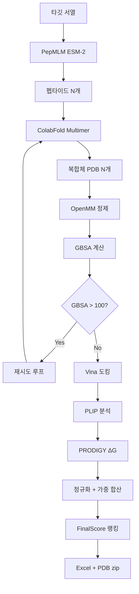

# pepbind05.py 파이프라인 인수인계 문서

## 1. 프로젝트 개요

**펩타이드 결합 예측 파이프라인(PDP: Peptide Docking Pipeline)**으로, 타깃 단백질에 대해 AI 기반 펩타이드 후보를 생성하고, 구조 예측·정제·평가·랭킹까지 자동으로 수행하는 단일 Python 스크립트(`pepbind05.py`, 4572줄).

### 실행 환경
- **OS**: Ubuntu (WSL2), GPU: NVIDIA (CUDA)
- **Conda env**: `pepbind_openmm` (Python 3.11)
- **파일 위치**: `/home/aisys/work/pipeline/pepbind05.py`
- **실행**: `python pepbind05.py` 또는 Jupyter kernel

---

## 2. 파이프라인 흐름 (8단계)

```
STEP 1: 입력/경로 설정 → 워크스페이스 생성 (PDP_YYYYMMDD_HHMMSS/)
STEP 2: PepMLM(ESM-2) → 펩타이드 후보 N개 생성 (GPU)
STEP 3: ColabFold Multimer → 타깃:펩타이드 복합체 구조 예측 (GPU/CPU fallback)
STEP 3b: OpenMM → minimize + short MD 정제 (Cα restraint, GPU→CPU fallback)
STEP 4: AutoDock Vina → 도킹 스코어 (CPU)
STEP 5: PLIP → 상호작용 분석 (H-bond, hydrophobic, salt bridge)
STEP 6: PRODIGY → 결합 자유에너지 ΔG
STEP 7: 실패 복합체 재시도 (GBSA > 100 → ColabFold부터 재실행, 최대 3회)
STEP 8: 최종 엑셀 + PDB zip 생성
```

### 워크스페이스 폴더 구조
```
PDP_YYYYMMDD_HHMMSS/
├── fasta/           # 타깃·펩타이드 FASTA
├── temp/            # 임시 파일 (ColabFold CSV 등)
├── colabfold_out/   # ColabFold 출력 (PDB, JSON)
├── pdb/             # rank_001 PDB + refined PDB
│   ├── refined/     # OpenMM 정제 출력
│   └── temp_gbsa/   # GBSA 계산 임시 파일
├── vina/            # Vina 결과 + vina_summary.xlsx
├── plip/            # PLIP 결과 + plip_summary.xlsx
├── prodigy/         # PRODIGY 결과 + prodigy_summary.xlsx
└── results/         # 최종 엑셀, PDB zip, 로그
```

---

## 3. 핵심 설정 파라미터 (스크립트 상단)

| 카테고리 | 파라미터 | 현재값 | 설명 |
|---------|---------|-------|------|
| **타깃** | `TARGET_SEQUENCE` | PD-L1 (227 aa) | 타깃 단백질 서열 |
| **생성** | `NUM_PEPTIDES` | 200 | 생성할 펩타이드 후보 수 |
| | `PEPTIDE_LENGTH` | 18 | 펩타이드 길이 (아미노산 수) |
| **PepMLM** | `PEPMLM_TOP_K` | 10 | 샘플링 시 상위 k개 아미노산 |
| | `PEPMLM_TEMPERATURE` | 1.0 | 샘플링 온도 |
| **ColabFold** | `COLABFOLD_MAX_MSA` | "256:512" | MSA 깊이 제한 |
| | `COLABFOLD_CPU_FALLBACK` | True | GPU OOM 시 CPU 재시도 |
| **OpenMM** | `REFINE_MD_TIME_PS` | 100.0 | short MD 시뮬레이션 시간 (ps) |
| | `REFINE_TIMESTEP_FS` | 2.0 | MD timestep (fs) |
| | `REFINE_RESTRAINT_K` | 1.0 | Cα position restraint 강도 |
| **평가** | `PRODIGY_DG_RANGE` | (-20, 0) | 정규화 범위 |
| | `VINA_SCORE_RANGE` | (-15, 0) | 정규화 범위 |
| | `PLIP_TOTAL_RANGE` | (0, 30) | 정규화 범위 |
| | `IPTM_RANGE` | (0, 1) | 정규화 범위 |
| **가중치** | `W_PRODIGY` | 0.50 | FinalScore 가중치 |
| | `W_VINA` | 0.25 | |
| | `W_PLIP` | 0.15 | |
| | `W_IPTM` | 0.10 | |
| **PLIP** | `PLIP_WEIGHT_HBOND` | 1.0 | H-bond 가중치 |
| | `PLIP_WEIGHT_HYDROPHOBIC` | 0.5 | Hydrophobic 가중치 |
| | `PLIP_WEIGHT_SALTBRIDGE` | 3.0 | Salt bridge 가중치 |
| **재시도** | `MAX_RETRY_ROUNDS` | 3 | 최대 재시도 횟수 |
| | `GBSA_FAILURE_THRESHOLD` | 100.0 | GBSA 실패 판정 기준 (kcal/mol) |
| | `RETRY_RANDOM_SEED_OFFSET` | 100 | 재시도 시 seed 오프셋 |
| **단계 ON/OFF** | `RUN_COLABFOLD` | True | 각 단계별 실행 스위치 |
| | `RUN_VINA` | True | |
| | `RUN_PLIP` | True | |
| | `RUN_PRODIGY` | True | |
| | `RUN_REFINEMENT` | True | |
| | `RUN_RETRY` | True | |

---

## 4. 핵심 함수 목록 (89개 중 주요 함수)

### 4.1 결과 캐시 시스템 (line 280-539)

```python
# 캐시 초기화 - 펩타이드 리스트로 빈 구조 생성
init_results_cache(peptides: list) -> dict

# 각 평가 결과를 캐시에 업데이트
update_cache_from_openmm(cache, complex_id, pdb_path, openmm_ok, gbsa_result)
update_cache_from_vina(cache, vina_scores, vina_statuses)
update_cache_from_plip(cache, plip_scores)
update_cache_from_prodigy(cache, prodigy_scores, prodigy_statuses)
update_cache_from_iptm(cache, iptm_scores)

# 캐시에서 실패 복합체 식별
get_failed_complexes_from_cache(cache, threshold=100.0) -> [(complex_id, peptide, reason)]

# 재시도 후 summary 파일 업데이트
update_summary_files_from_cache(results_cache, folders)
```

**캐시 구조** (각 complex_id 별):
```python
results_cache["complex_0"] = {
    "index": 0,                    # 원본 인덱스
    "peptide": "ACDEFG...",        # 펩타이드 서열
    "pdb_path": Path(...),         # 현재 PDB 경로
    "openmm_ok": True,             # OpenMM 정제 성공 여부
    "gbsa": -45.2,                 # GBSA 결합 에너지
    "gbsa_status": "정상",
    "gbsa_e_complex": ...,
    "gbsa_e_receptor": ...,
    "gbsa_e_peptide": ...,
    "vina_score": -7.3,
    "vina_status": "정상",
    "plip_total": 15.0,
    "plip_hbond": 5,
    "plip_hydrophobic": 3,
    "plip_saltbridge": 1,
    "plip_status": "정상",
    "prodigy_dg": -10.5,
    "prodigy_status": "정상",
    "iptm": 0.85,
    "retry_round": 0,              # 0=초기, 1~3=재시도 라운드
}
```

### 4.2 PepMLM 펩타이드 생성 (line 887-1049)
```python
load_esm_mlm(model_name="facebook/esm2_t12_35M_UR50D")
generate_peptides_with_mlm(tokenizer, model, target_sequence, num_peptides, peptide_len, top_k, temperature)
```
- ESM-2 masked language model 사용
- 타깃 서열 컨텍스트에서 [MASK] 토큰을 autoregressive하게 채움
- top-k + temperature 샘플링

### 4.3 ColabFold (line 1056-1347)
```python
prepare_colabfold_batch_csv(temp_dir, target_sequence, peptides)
run_colabfold_batch_with_progress(csv_path, out_dir, total_complexes, ...)
```
- `colabfold_batch` CLI subprocess 호출
- GPU → CPU fallback 지원
- 진행률 실시간 출력 + idle/total timeout 감지

### 4.4 OpenMM 구조 정제 (line 1355-1737)
```python
openmm_minimize_and_md(in_pdb, out_pdb, md_time_ps, timestep_fs, restraint_k)
refine_structures_with_openmm_and_relax(rank1_pdbs, pdb_root_dir, ..., results_cache)
```
- amber14-all + OBC2 implicit solvent
- Cα position restraint → minimize → NVT MD
- GPU(CUDA) → CPU fallback
- 정제 후 GBSA 계산하여 캐시 업데이트

### 4.5 GBSA 결합 에너지 계산 (line 1750-1955)
```python
_openmm_potential_energy_kcal(modeller, ff, minimize, minimize_max_iterations)
compute_openmm_gbsa_binding_energy(pdb_path, temp_dir, minimize=True, minimize_max_iterations=200)
```
- **Single-Trajectory MM-GBSA 방식**: `ΔE_bind = E_complex − (E_receptor + E_peptide)`
- Complex에 대해 minimization 수행 후 같은 좌표에서 receptor/peptide 분리
- 분리 후 재최적화 없음 (내부 에너지 상쇄 효과)
- 펩타이드 체인 = residue 수가 가장 적은 체인

### 4.6 AutoDock Vina (line 2113-2624)
```python
run_vina_on_rank1(rank1_pdbs, vina_dir)
load_vina_scores(vina_dir) -> (scores_dict, statuses_dict)
```
- obabel로 PDB→PDBQT 변환 (receptor: rigid, ligand: rigid)
- 리간드 좌표 기반 박스 자동 설정 (padding=10Å)
- vina_summary.xlsx 생성

### 4.7 PLIP (line 2631-3329)
```python
run_plip_on_rank1(rank1_pdbs, plip_dir)
load_plip_scores(plip_dir) -> (scores_dict, statuses_dict)
```
- PLIP CLI로 상호작용 분석 (XML 파싱)
- 가중치 적용: `weighted_total = hbond×1.0 + hydrophobic×0.5 + saltbridge×3.0`
- plip_summary.xlsx 생성

### 4.8 PRODIGY (line 2713-3021)
```python
run_prodigy_on_rank1(rank1_pdbs, out_dir)
load_prodigy_scores(prodigy_dir) -> (scores_dict, statuses_dict)
```
- prodigy CLI로 ΔG 예측
- stdout 파싱 (여러 출력 형식 지원)
- prodigy_summary.xlsx 생성

### 4.9 재시도 로직 (STEP 7, line 3823-4130, main: 4320-4516)
```python
identify_failed_complexes(peptides, rank1_pdbs, results_dir, threshold)  # 구 방식
get_failed_complexes_from_cache(cache, threshold)                        # 캐시 기반 (현재 사용)
run_colabfold_for_subset(peptides_to_retry, original_indices, target_seq, output_dir, ...)
update_summary_files_from_cache(results_cache, folders)
```

**재시도 흐름**:
1. 캐시에서 GBSA > 100 복합체 식별
2. ColabFold 배치 재실행 (다른 random seed)
3. 단계 1: 모든 복합체 OpenMM 정제 + GBSA 계산
4. 개선된 복합체만 목록에 추가
5. 단계 2: 개선된 복합체들만 배치 Vina/PLIP/PRODIGY 평가
6. 캐시 업데이트 → 여전히 실패하면 반복 (최대 3회)
7. 재시도 완료 후 summary 파일 업데이트

### 4.10 최종 테이블 생성 (line 3388-3816)
```python
build_and_save_final_table(folders, peptides, rank1_pdbs, ..., results_cache)
```
- 5개 시트: `rank_table`, `all_metrics`, `norm_debug`, `run_info`, `weights_info`
- FinalScore = w_prodigy×norm_PRODIGY + w_vina×norm_Vina + w_plip×norm_PLIP + w_iptm×norm_ipTM
- 정규화: `fixed_range_norm()` (고정 범위 기반 0-1 스케일링)
- 재시도된 복합체는 캐시에서 최종 값 가져옴
- `retry_round` 컬럼으로 재시도 여부 표시

---

## 5. 외부 도구 의존성

| 도구 | 용도 | 설치 위치 |
|------|------|----------|
| ColabFold (`colabfold_batch`) | 구조 예측 | conda env |
| AutoDock Vina (`vina`) | 도킹 스코어 | system/conda |
| PLIP (`plip`) | 상호작용 분석 | conda env |
| PRODIGY (`prodigy`) | 결합 친화도 | conda env |
| OpenBabel (`obabel`) | PDB↔PDBQT 변환 | system |
| OpenMM | MD/Energy 계산 | conda env |
| PyTorch + Transformers | PepMLM (ESM-2) | conda env |

---

## 6. 현재 알려진 이슈 및 개선 과제

### 🔴 GBSA 값이 과도하게 음수로 나오는 문제

**원인 분석** (검증 완료):

1. **Complex minimization에 position restraint 없음** (`_openmm_potential_energy_kcal`, line 1786-1790)
   - `openmm.LocalEnergyMinimizer.minimize(context, maxIterations=200)` 호출 시 restraint 미적용
   - 펩타이드가 비현실적으로 단백질 안쪽으로 파고들 수 있음
   - E_complex가 과도하게 낮아져 GBSA_bind가 비현실적 음수 발생
   - `openmm_minimize_and_md()`에서는 Cα restraint를 쓰지만, GBSA 계산 시에는 미적용

2. **Potential Energy 기반 근사**
   - 엔트로피 기여(-TΔS) 미반영 → 결합 유리한 쪽 편향
   - Implicit solvent의 한계
   - 작은 펩타이드일수록 정전기 과대평가 (18-mer로 변경 후 완화 가능)

3. **체인 선택 로직** (line 1889): `min(chain_res, key=lambda x: x[1])` → 대부분 정상 작동하지만 edge case 가능

**제안된 해결 방안**:
- **A안 (추천)**: Complex minimization 시 backbone Cα restraint 추가
- **B안**: minimize_max_iterations 축소 (200→50)
- **C안**: minimize=False로 변경 (MD 후 좌표 그대로 사용)

### 🟡 Summary 파일 누적 문제 (해결됨)
- 재시도 시 Vina/PLIP/PRODIGY 결과가 summary 파일에 누적 추가되던 문제
- `update_summary_files_from_cache()` 함수로 최종 값 덮어쓰기 구현

### 🟡 기타 해결된 이슈
- `load_plip_scores()` 튜플 반환값 unpacking 오류 (해결)
- `run_colabfold_for_subset()` 튜플 반환값 처리 오류 (해결)
- 재시도 시 Vina/PLIP/PRODIGY 미실행 → 배치 처리 방식으로 해결

---

## 7. 최종 출력물

### Excel 파일: `final_peptide_rank_YYYYMMDD_HHMMSS.xlsx`

| 시트 | 내용 |
|------|------|
| `rank_table` | FinalScore 기준 랭킹 (주요 지표만) |
| `all_metrics` | 전체 평가 지표 + GBSA 상세 |
| `norm_debug` | 정규화 값 + 가중치 기여도 디버그용 |
| `run_info` | 실행 환경, 시작/종료 시간, 각 STEP 소요시간 |
| `weights_info` | 가중치 설정 정보 |

### PDB zip: `rank1_structures_YYYYMMDD_HHMMSS.zip`
- 모든 복합체의 rank_001 PDB (재시도된 경우 최종 PDB)

---

## 8. 코드 구조 요약

```
pepbind05.py (4572줄)
├── [1-175]     설정 파라미터
├── [176-565]   유틸리티 (캐시, 타이밍, 로깅)
├── [566-880]   헬퍼 함수 (파싱, Excel 조정)
├── [881-1049]  STEP 2: PepMLM 펩타이드 생성
├── [1050-1347] STEP 3: ColabFold 배치
├── [1348-1955] STEP 3b: OpenMM 정제 + GBSA 계산
├── [1958-2624] STEP 4: AutoDock Vina
├── [2625-2706] STEP 5: PLIP
├── [2707-2848] STEP 6: PRODIGY
├── [2849-3385] 점수 로딩/정규화/유효성 검증
├── [3386-3816] build_and_save_final_table (최종 엑셀)
├── [3817-4130] 재시도 관련 함수
├── [4131-4567] main() 함수
└── [4568-4572] if __name__ == "__main__"
```

---

## 9. 주요 데이터 흐름



> **참고**: 실제로는 초기 실행에서 모든 복합체가 STEP 6까지 진행된 후, STEP 7에서 GBSA > 100인 복합체만 재시도됩니다. 위 다이어그램은 논리적 흐름을 강조한 것입니다.
