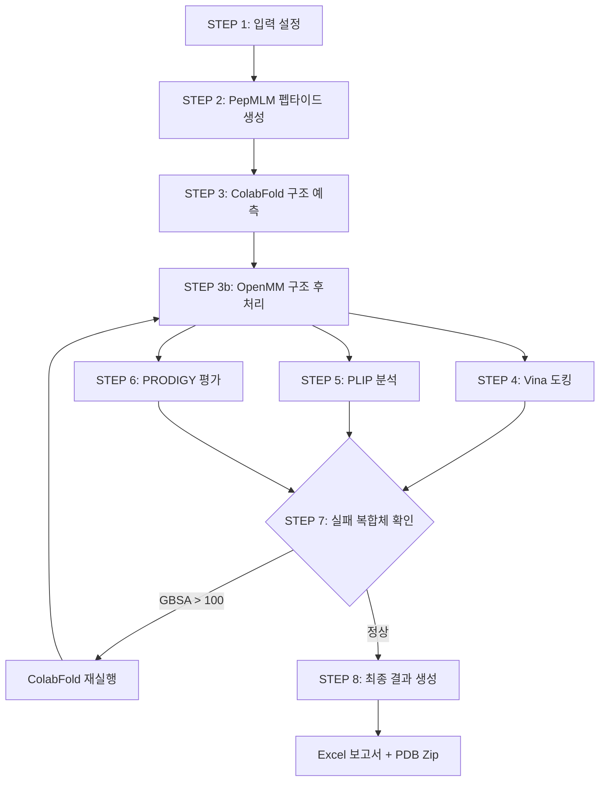

# PepBind Pipeline - 종합 가이드 문서

## 📋 목차

1. [프로젝트 개요](#프로젝트-개요)
2. [아키텍처](#아키텍처)
3. [모듈 및 파일 구조](#모듈-및-파일-구조)
4. [설치 및 환경 설정](#설치-및-환경-설정)
5. [실행 방법](#실행-방법)
6. [설정 파일 설명](#설정-파일-설명)
7. [주요 기능 사용법](#주요-기능-사용법)
8. [출력 결과 해석](#출력-결과-해석)
9. [트러블슈팅](#트러블슈팅)
10. [고급 사용법](#고급-사용법)

---

## 프로젝트 개요

### 목적
**PepBind Pipeline**은 타깃 단백질에 결합하는 최적의 펩타이드를 발견하기 위한 자동화된 AI 기반 파이프라인입니다.

### 핵심 기능
- 🧬 **AI 기반 펩타이드 생성**: PepMLM (ESM-2) 모델을 사용한 펩타이드 후보 생성
- 🔬 **구조 예측**: ColabFold를 통한 단백질-펩타이드 복합체 3D 구조 예측
- ⚡ **구조 최적화**: OpenMM을 이용한 에너지 최소화 및 분자동역학 시뮬레이션
- 🎯 **다중 평가**: Vina, PLIP, PRODIGY, GBSA를 통한 종합적 결합 친화도 평가
- 🔄 **자동 재시도**: 실패한 복합체 자동 감지 및 재생성 (최대 3회)
- 📊 **통합 보고서**: Excel 형식의 상세한 결과 분석 및 순위 매김

### 주요 특징
- **완전 자동화**: 펩타이드 생성부터 최종 평가까지 원클릭 실행
- **GPU 가속**: ColabFold 및 OpenMM의 GPU 지원으로 빠른 처리
- **실패 복구**: GBSA > 100 kcal/mol 또는 OpenMM 실패 시 자동 재시도
- **다중 평가 지표**: 4가지 독립적 평가 방법의 가중 평균으로 신뢰도 향상

---

## 아키텍처

### 전체 워크플로우



### 데이터 흐름

```
타깃 서열 → PepMLM → 펩타이드 후보들
                          ↓
                    ColabFold → 복합체 PDB
                          ↓
                    OpenMM → 정제된 PDB
                          ↓
        ┌─────────────────┼─────────────────┐
        ↓                 ↓                 ↓
      Vina              PLIP            PRODIGY
        ↓                 ↓                 ↓
        └─────────────────┼─────────────────┘
                          ↓
                    가중 평균 스코어
                          ↓
                    최종 순위 매김
```

### 기술 스택

| 계층 | 기술 |
|------|------|
| **AI 모델** | ESM-2 (PepMLM), AlphaFold2 (ColabFold) |
| **분자동역학** | OpenMM, GBSA implicit solvent |
| **도킹** | AutoDock Vina |
| **상호작용 분석** | PLIP |
| **친화도 예측** | PRODIGY |
| **프로그래밍** | Python 3.11 |
| **주요 라이브러리** | PyTorch, Transformers, BioPython, OpenMM, Pandas, OpenPyXL |

---

## 모듈 및 파일 구조

### 핵심 파일

#### `pepbind05.py` (메인 파이프라인)
**역할**: 전체 파이프라인 오케스트레이션

**주요 클래스/함수**:
- `generate_peptides_with_pepmlm()`: PepMLM을 사용한 펩타이드 생성
- `run_colabfold_batch_with_progress()`: ColabFold 실행 및 진행 상황 모니터링
- `refine_structures_with_openmm_and_relax()`: OpenMM 구조 정제
- `run_vina_on_rank1()`: Vina 도킹 실행
- `run_plip_on_rank1()`: PLIP 상호작용 분석
- `run_prodigy_on_rank1()`: PRODIGY 친화도 평가
- `compute_openmm_gbsa_binding_energy()`: GBSA 결합 에너지 계산
- `identify_failed_complexes()`: 실패 복합체 탐지
- `process_retry_complexes_pipeline()`: 재시도 파이프라인
- `build_and_save_final_table()`: 최종 Excel 보고서 생성
- `main()`: 메인 실행 함수

**책임**:
- 8단계 파이프라인 순차 실행
- 각 단계별 시간 측정 및 로깅
- 실패 복합체 자동 재시도 (최대 3회)
- 최종 결과 통합 및 보고서 생성

#### `pepbind04.py` (이전 버전)
재시도 기능이 없는 버전 (참고용)

#### `pepbind_pipeline.py` (초기 버전)
MSA 수동 설정 버전 (참고용)

### 환경 설정 파일

#### `environment_pepbind.yml`
Conda 환경 정의 (기본 패키지)

#### `pepbind_full.yml`
전체 의존성 목록 (pip freeze 결과)

#### `pepbind_min.yml`
최소 필수 패키지

### 분석 스크립트

#### `analyze_gbsa.py`
GBSA 값 분석 유틸리티

#### `analyze_interchain.py`
체인 간 거리 분석

#### `analyze_pdb_structure.py`
PDB 구조 검증

#### `identify_failed.py`
실패 복합체 식별 헬퍼

### 문서

#### `RULES.md`
코딩 스타일 및 프로젝트 규칙

#### `reports/`
실행 결과 보고서 저장 디렉토리

---

## 설치 및 환경 설정

### 시스템 요구사항

**하드웨어**:
- CPU: 8코어 이상 권장
- RAM: 32GB 이상 권장
- GPU: NVIDIA GPU (CUDA 지원) - ColabFold 및 OpenMM 가속용
- 저장공간: 100GB 이상 (ColabFold 모델 및 결과 저장용)

**소프트웨어**:
- OS: Linux (Ubuntu 20.04+) 또는 WSL2
- Python: 3.11
- CUDA: 11.8+ (GPU 사용 시)

### 설치 단계

#### 1. Conda 환경 생성

```bash
# 환경 생성
conda env create -f environment_pepbind.yml

# 또는 최소 버전
conda env create -f pepbind_min.yml

# 환경 활성화
conda activate pepbind_openmm
```

#### 2. 추가 패키지 설치

```bash
# PyTorch (CUDA 버전)
conda install pytorch torchvision torchaudio pytorch-cuda=11.8 -c pytorch -c nvidia

# Transformers
pip install transformers

# OpenMM
conda install -c conda-forge openmm

# BioPython
pip install biopython

# 기타 필수 패키지
pip install pandas numpy openpyxl
```

#### 3. 외부 도구 설치

**ColabFold**:
```bash
pip install colabfold[alphafold]
```

**AutoDock Vina**:
```bash
conda install -c conda-forge vina
```

**PLIP**:
```bash
pip install plip
```

**PRODIGY**:
```bash
pip install prodigy-prot
```

**Open Babel** (선택사항):
```bash
conda install -c conda-forge openbabel
```

#### 4. 환경 변수 설정

`.bashrc` 또는 `.zshrc`에 추가:

```bash
export PEPBIND_BASE_DIR="$HOME/work/pipeline"
export COLABFOLD_CMD="colabfold_batch"
export VINA_CMD="vina"
export PLIP_CMD="plip"
export PRODIGY_SCRIPT="prodigy"
```

---

## 실행 방법

### 기본 실행

#### 1. 설정 수정

`pepbind05.py` 파일의 상단 설정 영역 수정:

```python
# 타깃 단백질 서열
TARGET_SEQUENCE = "AFTVTVPKDLYVVEYGSNMTIECKFPVEKQLDLAALIVYWEMEDKNIIQFVHGEEDLKVQHSSYRQRARLLKDQLSLGNAALQITDVKLQDAGVYRCMISYGGADYKRITVKVNAPYNKINQRILVVDPVTSEHELTCQAEGYPKAEVIWTSSDHQVLSGKTTTTNSKREEKLFNVTSTLRINTTTNEIFYCTFRRLDPEENHTAELVIPELPLAHPPNERT"

# 펩타이드 생성 설정
NUM_PEPTIDES = 50      # 생성할 펩타이드 개수
PEPTIDE_LENGTH = 4     # 펩타이드 길이 (아미노산 개수)

# 단계별 실행 여부
RUN_COLABFOLD = True
RUN_VINA = True
RUN_PLIP = True
RUN_PRODIGY = True
```

#### 2. 파이프라인 실행

```bash
# Conda 환경 활성화
conda activate pepbind_openmm

# 파이프라인 실행
python pepbind05.py
```

### Jupyter Notebook에서 실행

```python
# Notebook에서 실행
%run pepbind05.py
```

### 단계별 실행

특정 단계만 실행하려면:

```python
# ColabFold만 스킵
RUN_COLABFOLD = False
RUN_VINA = True
RUN_PLIP = True
RUN_PRODIGY = True
```

---

## 설정 파일 설명

### 주요 설정 파라미터

#### 펩타이드 생성 설정

```python
NUM_PEPTIDES = 50          # 생성할 펩타이드 후보 개수
PEPTIDE_LENGTH = 4         # 펩타이드 길이 (4-20 권장)
PEPMLM_MODEL = "facebook/esm2_t33_650M_UR50D"  # PepMLM 모델
PEPMLM_TEMPERATURE = 1.0   # 생성 다양성 (높을수록 다양)
PEPMLM_TOP_K = 20          # Top-K 샘플링
```

#### ColabFold 설정

```python
COLABFOLD_MAX_MSA = "32:64"           # MSA 깊이 제한
COLABFOLD_MAX_IDLE_MIN = 30           # 최대 유휴 시간 (분)
COLABFOLD_MAX_TOTAL_MIN = 120         # 최대 총 실행 시간 (분)
COLABFOLD_CPU_FALLBACK = True         # GPU 실패 시 CPU 사용
COLABFOLD_NUM_MODELS = 1              # 사용할 모델 수
COLABFOLD_NUM_RECYCLE = 3             # 재순환 횟수
```

#### OpenMM 정제 설정

```python
RUN_REFINEMENT = True                 # 구조 정제 실행 여부
REFINE_MD_TIME_PS = 10.0              # MD 시뮬레이션 시간 (ps)
REFINE_TIMESTEP_FS = 2.0              # 시간 간격 (fs)
REFINE_RESTRAINT_K = 10.0             # 위치 제약 강도
```

#### 재시도 설정

```python
RUN_RETRY = True                      # 재시도 기능 활성화
MAX_RETRY_ROUNDS = 3                  # 최대 재시도 횟수
GBSA_FAILURE_THRESHOLD = 100.0        # GBSA 실패 임계값 (kcal/mol)
RETRY_RANDOM_SEED_OFFSET = 100        # 재시도 시 seed 오프셋
```

#### 평가 가중치

```python
WEIGHT_PRODIGY = 0.50    # PRODIGY ΔG
WEIGHT_VINA = 0.25       # Vina 도킹 스코어
WEIGHT_PLIP = 0.15       # PLIP 상호작용 수
WEIGHT_IPTM = 0.10       # ipTM (구조 신뢰도)
```

#### 정규화 범위

```python
PRODIGY_DG_RANGE = (-20.0, 0.0)       # PRODIGY ΔG 범위
VINA_RANGE = (-12.0, 0.0)             # Vina 스코어 범위
PLIP_TOTAL_RANGE = (0.0, 30.0)        # PLIP 총 상호작용 수
IPTM_RANGE = (0.0, 1.0)               # ipTM 범위
```

---

## 주요 기능 사용법

### 1. 펩타이드 생성

```python
peptides = generate_peptides_with_pepmlm(
    target_seq=TARGET_SEQUENCE,
    num_peptides=50,
    peptide_length=4,
    temperature=1.0,
    top_k=20
)
```

**출력**: 50개의 펩타이드 서열 리스트

### 2. 구조 예측

```python
rank1_pdbs = run_colabfold_batch_with_progress(
    csv_path=input_csv,
    output_dir=colabfold_output_dir,
    total_complexes=50
)
```

**출력**: 각 복합체의 rank_001 PDB 파일 경로 리스트

### 3. 구조 정제

```python
refined_pdbs = refine_structures_with_openmm_and_relax(
    rank1_pdbs=rank1_pdbs,
    pdb_base_dir=pdb_dir,
    md_time_ps=10.0
)
```

**출력**: OpenMM으로 정제된 PDB 파일 경로 리스트

### 4. GBSA 계산

```python
gbsa_result = compute_openmm_gbsa_binding_energy(
    pdb_path=pdb_file,
    temp_dir=temp_dir,
    minimize=True
)

print(f"GBSA_bind: {gbsa_result['GBSA_bind']} kcal/mol")
```

**출력**:
```python
{
    'status': '정상',
    'ligand_chain': 'B',
    'E_complex': -1234.56,
    'E_receptor': -1000.12,
    'E_peptide': -250.34,
    'GBSA_bind': 15.90
}
```

### 5. 실패 복합체 탐지

```python
failed = identify_failed_complexes(
    peptides=peptides,
    rank1_pdbs=rank1_pdbs,
    results_dir=results_dir,
    threshold=100.0
)

for idx, pep, reason in failed:
    print(f"complex_{idx}: {reason}")
```

---

## 출력 결과 해석

### 폴더 구조

```
PDP_YYYYMMDD_HHMMSS/
├── pdb/
│   ├── colabfold_output/       # 초기 ColabFold 결과
│   ├── colabfold_retry_1/      # 1차 재시도 결과
│   ├── colabfold_retry_2/      # 2차 재시도 결과
│   └── refined/                # OpenMM 정제 PDB
├── results/
│   ├── vina/                   # Vina 도킹 결과
│   │   ├── vina_summary.xlsx
│   │   └── complex_*/
│   ├── plip/                   # PLIP 분석 결과
│   │   ├── plip_summary.xlsx
│   │   └── complex_*/
│   ├── prodigy/                # PRODIGY 결과
│   │   ├── prodigy_summary.xlsx
│   │   └── *_prodigy.txt
│   ├── final_peptide_rank_*.xlsx  # 최종 결과
│   └── peptide_structures_*.zip   # PDB 압축 파일
└── temp/                       # 임시 파일
```

### Excel 보고서 구조

#### `rank` 시트
최종 순위 및 주요 정보

| 컬럼 | 설명 |
|------|------|
| rank | 최종 순위 (FinalScore 기준) |
| candidate_id | 복합체 ID (complex_0, complex_1, ...) |
| peptide_seq | 펩타이드 서열 |
| complex_pdb | PDB 파일명 |
| FinalScore | 최종 종합 점수 (0-1, 높을수록 좋음) |
| PRODIGY_dG | PRODIGY 결합 자유에너지 (kcal/mol) |
| Vina_score | Vina 도킹 스코어 (kcal/mol) |
| PLIP_total | PLIP 총 상호작용 수 |
| ipTM | 구조 신뢰도 (0-1) |
| GBSA_bind | GBSA 결합 에너지 (kcal/mol) |

#### `all_metrics` 시트
모든 평가 지표 상세 정보

추가 컬럼:
- `PLIP_hbond`: 수소결합 수
- `PLIP_hydrophobic`: 소수성 상호작용 수
- `PLIP_saltbridge`: 염다리 수
- `AlphaFold_status`: 구조 예측 상태
- `GBSA_status`: GBSA 계산 상태
- `vina_status`: Vina 실행 상태
- `plip_status`: PLIP 분석 상태
- `PRODIGY_status`: PRODIGY 평가 상태

#### `norm_debug` 시트
정규화 과정 디버그 정보

#### `settings` 시트
실행 설정 및 단계별 소요 시간

---

## 트러블슈팅

### 일반적인 문제

#### 1. ColabFold GPU 메모리 부족

**증상**:
```
CUDA out of memory
```

**해결책**:
```python
# MSA 깊이 줄이기
COLABFOLD_MAX_MSA = "16:32"  # 기본값: "32:64"

# 또는 CPU 폴백 활성화
COLABFOLD_CPU_FALLBACK = True
```

#### 2. OpenMM 정제 실패

**증상**:
```
OpenMM 정제 실패 (원본 ColabFold PDB 사용)
```

**원인**: PDB 파일의 원자 좌표 문제 또는 ForceField 호환성

**해결책**:
```python
# 정제 비활성화
RUN_REFINEMENT = False

# 또는 MD 시간 줄이기
REFINE_MD_TIME_PS = 5.0  # 기본값: 10.0
```

#### 3. GBSA 값이 매우 높음 (> 500)

**증상**:
```
GBSA > 100 (실제: 750.23)
```

**원인**: 구조적 문제 (원자 충돌, 부적절한 접힘)

**해결책**:
- 자동 재시도 기능이 활성화되어 있으면 자동으로 재생성됨
- 재시도 후에도 실패하면 해당 펩타이드 제외 고려

#### 4. Vina 실행 실패

**증상**:
```
실패: Vina 실행 에러(code=1)
```

**해결책**:
```bash
# Vina 설치 확인
which vina

# 재설치
conda install -c conda-forge vina

# 환경 변수 확인
echo $VINA_CMD
```

#### 5. PLIP 분석 실패

**증상**:
```
PLIP 실행 실패
```

**해결책**:
```bash
# PLIP 재설치
pip uninstall plip
pip install plip

# 또는 Docker 버전 사용
docker pull pharmai/plip
```

### 성능 최적화

#### GPU 사용 최적화

```python
# ColabFold GPU 사용 확인
import torch
print(f"CUDA available: {torch.cuda.is_available()}")
print(f"CUDA device: {torch.cuda.get_device_name(0)}")

# OpenMM GPU 플랫폼 확인
from openmm import Platform
for i in range(Platform.getNumPlatforms()):
    platform = Platform.getPlatform(i)
    print(f"Platform {i}: {platform.getName()}")
```

#### 메모리 관리

```python
# 펩타이드 수 조절
NUM_PEPTIDES = 20  # 메모리 부족 시 줄이기

# 배치 처리
# ColabFold는 자동으로 배치 처리하지만,
# 필요시 수동으로 분할 실행 가능
```

### 로그 분석

#### 단계별 시간 확인

최종 Excel의 `settings` 시트에서 각 단계별 소요 시간 확인

#### 실패 원인 파악

```python
# GBSA 상태 확인
df = pd.read_excel("final_peptide_rank_*.xlsx", sheet_name="all_metrics")
failed = df[df['GBSA_bind'] > 100]
print(failed[['candidate_id', 'GBSA_bind', 'GBSA_status']])

# Vina 상태 확인
print(df[['candidate_id', 'Vina_score', 'vina_status']])
```

---

## 고급 사용법

### 커스텀 평가 가중치

```python
# 도킹 스코어 중시
WEIGHT_PRODIGY = 0.30
WEIGHT_VINA = 0.50
WEIGHT_PLIP = 0.15
WEIGHT_IPTM = 0.05

# 구조 신뢰도 중시
WEIGHT_PRODIGY = 0.40
WEIGHT_VINA = 0.20
WEIGHT_PLIP = 0.10
WEIGHT_IPTM = 0.30
```

### 배치 실행

```bash
# 여러 타깃에 대해 순차 실행
for target in target1 target2 target3; do
    python pepbind05.py --target $target
done
```

### 결과 병합

```python
import pandas as pd

# 여러 실행 결과 병합
results = []
for run_dir in ["PDP_20260101_*", "PDP_20260102_*"]:
    excel_file = list(Path(run_dir).glob("results/final_*.xlsx"))[0]
    df = pd.read_excel(excel_file, sheet_name="rank")
    results.append(df)

merged = pd.concat(results, ignore_index=True)
merged.to_excel("merged_results.xlsx", index=False)
```

### 재시도 전략 커스터마이징

```python
# 재시도 횟수 증가
MAX_RETRY_ROUNDS = 5

# GBSA 임계값 조정
GBSA_FAILURE_THRESHOLD = 50.0  # 더 엄격하게

# 재시도 시 다른 seed 사용
RETRY_RANDOM_SEED_OFFSET = 200
```

---

## 참고 자료

### 관련 논문
- **AlphaFold2**: Jumper et al., Nature 2021
- **ESM-2**: Lin et al., bioRxiv 2022
- **ColabFold**: Mirdita et al., Nature Methods 2022
- **AutoDock Vina**: Trott & Olson, J. Comput. Chem. 2010
- **PLIP**: Salentin et al., Nucleic Acids Res. 2015
- **PRODIGY**: Xue et al., Bioinformatics 2016

### 외부 링크
- [ColabFold GitHub](https://github.com/sokrypton/ColabFold)
- [OpenMM Documentation](http://docs.openmm.org/)
- [AutoDock Vina](https://vina.scripps.edu/)
- [PLIP](https://plip-tool.biotec.tu-dresden.de/)
- [PRODIGY](https://wenmr.science.uu.nl/prodigy/)

---

## 라이선스 및 인용

이 프로젝트를 사용하는 경우, 사용된 각 도구의 원저자를 인용해주세요.

**PepBind Pipeline**:
```
[Your Citation Here]
```

---

**문서 버전**: 1.0  
**최종 업데이트**: 2026-02-03  
**작성자**: PepBind Development Team
